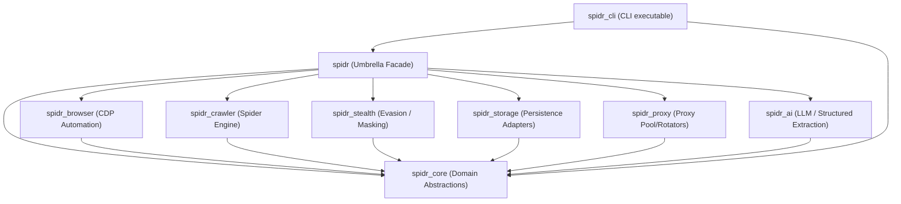

# SPIDR Architecture

This document describes the architectural principles, component structure, dependency diagrams, and platform capability rules for the SPIDR framework.

---

## 🏗️ Core Architectural Principles

1. **Pure Dart execution**: The codebase relies strictly on Dart API designs. It compiles cleanly to JavaScript, WebAssembly, and native machine code across all standard Dart/Flutter platforms.
2. **Modular plugins**: Core functionality is kept lean. Features like browser automation, crawlers, storage, stealth evasion, proxy routing, and AI are implemented in separate packages that plug into core interfaces.
3. **Strong typing**: Zero dependency on dynamic-heavy maps or weak types. Everything from request configurations, capabilities, response metrics, and DOM elements is strongly typed.
4. **Platform safety & Capability detection**: SPIDR does not assume desktop, web, or mobile runtimes. Platform-specific adapters are detected at runtime, ensuring the framework degrades gracefully instead of throwing compiler errors or crash loops.

---

## 🧩 Component Overview

The system is structured as a monorepo workspace divided into independent, decoupled packages:

---

## 🛡️ Platform Capability & Graceful Degradation

SPIDR uses runtime checks via `SpidrCapabilities` defined in `spidr_core` to expose which features are supported on the current running host.

### Capability Matrix

| Platform | Core Scrapes | Browser Automation | Persistence | Rotating Proxies | Isolate Workers |
|----------|:------------:|:------------------:|:-----------:|:----------------:|:---------------:|
| **Android / iOS** | ✅ Yes | ⚠️ Remote Only | ✅ Isar | ✅ Yes | ✅ Yes |
| **Web** | ✅ Yes (CORS dependent) | ⚠️ Remote Only | ✅ IndexedDB | ⚠️ Limited | ⚠️ Web Workers |
| **Windows / macOS / Linux** | ✅ Yes | ✅ Yes (Local Chrome) | ✅ SQLite/Isar | ✅ Yes | ✅ Yes |
| **Server / CLI** | ✅ Yes | ✅ Yes (Local Chrome) | ✅ SQLite/Isar | ✅ Yes | ✅ Yes |

If a platform lacks native capabilities (e.g. attempting to launch a local Chrome binary inside a Flutter Web sandbox), SPIDR fails gracefully:
1. Re-routes execution (e.g., using a remote CDP WebSocket instead of executing process spawning).
2. Throws a standardized `UnsupportedCapabilityException` that the user application can catch and handle, rather than hard-crashing.

---

## 🔌 Extensibility & Plugin Points

All advanced features interact strictly with base interfaces defined in `spidr_core`. Developers can easily swap out implementation details by implementing the base classes:

- **`SpidrClient`**: Extend to use alternative HTTP drivers (e.g. `dio`, standard `HttpClient`, or `http`).
- **`StorageAdapter`**: Add adapters for custom backends (e.g., Hive, Postgres, or custom JSON flatfiles).
- **`BrowserProvider`**: Plug in custom browser drivers (e.g., WebDriver, custom CDP proxies).
- **`ProxyProvider`**: Custom rotation logic or integration with cloud proxy networks.
- **`AiExtractor`**: Connect to custom local LLMs or third-party cloud APIs.
